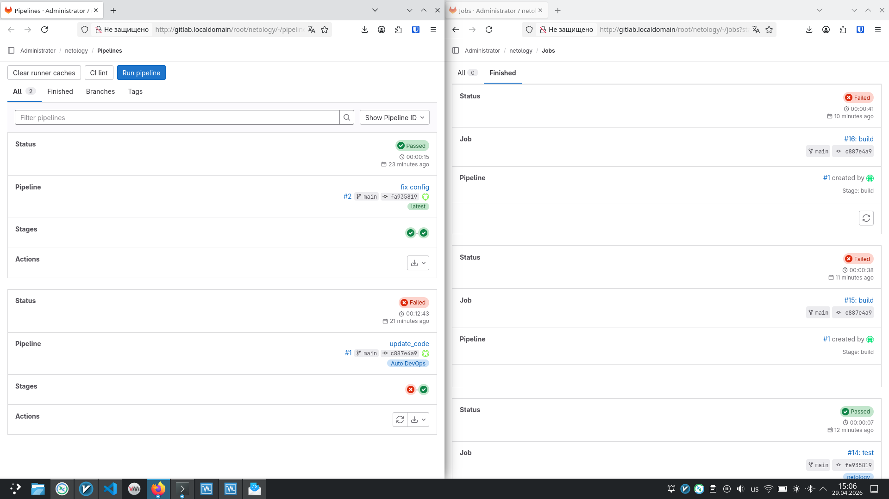

# Домашнее задание к занятию "8_03_GitLab" - `Борисенко Даниил`

### Задание 1

1. GitLab был развёрнут с помощью Vagrant.

2. Создан проект netology и зарегистрирован runner для проекта через docker

Скриншот созданного проекта и настроек runnera:

### Задание 2

Для выполнения задания репозиторий был запушен в локальный GitLab.

На мой взгляд, для этого проекта важны следующие этапы:

1. test. На данном этапе код проходит проверку перед компиляцией.
   В случае ошибки - проект не будет собираться.

2. build. Во время этого этапа проект собирается и успешно компилируется, но только после успешного прохождения тестов.
   Данные этапы позволяют быстро локализовать проблемы проекта и способствуют повышению надежности проекта.

В данном варианте я использовал простой пайплайн, в связи с ограниченными техническими характеристиками. 

Содержимое .gitlab-ci.yml:

stages:
  - test
  - build

test:
  stage: test
  image: golang:1.17
  tags:
    - netology
  script:
    - go test ./...

build:
  stage: build
  image: golang:1.17
  tags:
    - netology
  script:
    - go build .

